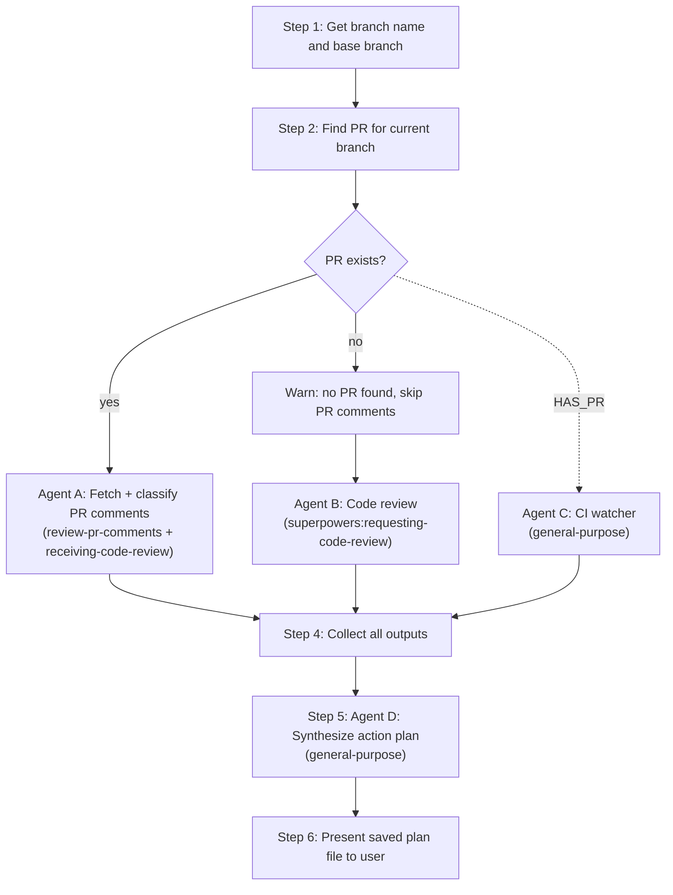

# Comprehensive Review

Orchestrates 4 subagents to fetch unresolved PR comments, run automated code review, watch CI checks, and synthesize everything into a severity-ranked action plan saved to file. Parallel dispatch of comment fetching, code review, and CI watching, then sequential synthesis.

**Announce at start:** "I'm using the comprehensive-review skill to build a prioritized action plan from PR feedback and code review."

## When to Use

- Before addressing PR feedback (get the full picture first)
- Before final merge (catch everything in one pass)
- When wanting a consolidated view of all issues across PR comments and code quality

## The Process



## Controller Steps

Follow these steps exactly. Do not skip or reorder.

### Step 1: Get branch name and base branch

```bash
BRANCH_NAME=$(git branch --show-current)
BASE_BRANCH="main"  # Default; overridden in Step 2 if PR exists with a different base
```

Store `BRANCH_NAME` and `BASE_BRANCH` for use in later steps.

### Step 2: Find PR for current branch

```bash
gh pr view --json number,url,baseRefName,title,body 2>/dev/null
gh repo view --json owner,name -q '"\(.owner.login)/\(.name)"'
```

- If a PR exists, note the PR number, URL, title, body, base branch, and owner/repo. Update `BASE_BRANCH` to the PR's `baseRefName` if different from main. Store the owner/repo string as `OWNER_REPO`.

- If no PR exists, warn the user: "No open PR found for branch `{BRANCH_NAME}`. Skipping PR comment analysis. Proceeding with code review only." In this case, get the description from the first 5 commit messages: `git log --oneline ${BASE_BRANCH}..HEAD | head -5`.

### Step 3: Dispatch agents and checks in parallel

In a **single message**, dispatch all of the following concurrently:

**If PR exists:** Dispatch Agent A, Agent B, and Agent C in one message with three tool calls.

**If no PR:** Dispatch Agent B and Agent C in one message with two tool calls.

**Agent A** (PR Comments Fetcher + Classifier):

- **Tool:** Task with `subagent_type: "general-purpose"`
- **Prompt:**
  ```
  Step 1: Invoke the `review-pr-comments` skill to fetch all unresolved PR comments for the current branch.

  Step 2: Invoke the `superpowers:receiving-code-review` skill and apply its discipline to each comment. For each comment, verify against the codebase (read the actual referenced file/lines) and classify as one of:
    - `legit-implement` — comment is correct, should be addressed
    - `needs-clarification` — comment is ambiguous or you can't verify without more info
    - `push-back` — comment is technically incorrect for this codebase; include technical reasoning
    - `already-addressed` — already fixed in a later commit on this branch

  Step 3: Return structured output. For each comment include: file:line reference, original comment text, classification, and (if push-back) the technical reasoning. Do not reply on GitHub — this is read-only triage.
  ```

**Agent B** (Code Reviewer):

- **Tool:** Task with `subagent_type: "general-purpose"`
- **Prompt:**
  ```
  Invoke the `superpowers:requesting-code-review` skill to dispatch a code review. Use these inputs when filling the skill's template:

    - DESCRIPTION: {DESCRIPTION}
    - PLAN_OR_REQUIREMENTS: {DESCRIPTION} (use the same description as plan reference; we are reviewing branch work against its stated intent)
    - BASE_SHA: output of `git merge-base {BASE_BRANCH} HEAD`
    - HEAD_SHA: output of `git rev-parse HEAD`

  Also read `CLAUDE.md` at the repo root if present, and flag any convention violations in the review output.

  Return the reviewer's full output (Strengths, Critical / Important / Minor issues, Recommendations, Assessment).
  ```
- Replace `{DESCRIPTION}` with the PR title + first paragraph of PR body (or the first 5 commit messages if no PR exists), and `{BASE_BRANCH}` with the actual base branch.

**Agent C** (CI Watcher):

- **Tool:** Task with `subagent_type: "general-purpose"`
- **Prompt:** Use the prompt below, replacing `{HAS_PR}` with `true` or `false` (from Step 2) and `{BRANCH_NAME}` with the actual branch name (from Step 1).
- This watches CI for results instead of running checks locally. The output will be collected in Step 4.

Agent C prompt:

```
You are a CI watcher. Your job is to get the results of CI checks for branch `{BRANCH_NAME}` and return a structured report. Do not attempt to fix any issues — just report the results.

Follow this resolution chain. Try each step in order and stop at the first one that works.

## Step 1: PR-based check watching (only if {HAS_PR} is true)

Run (with a 10-minute Bash timeout):
  gh pr checks --watch --json name,bucket,state,link

Design note: `--fail-fast` is intentionally omitted. Waiting for all checks ensures the action plan captures every failure, not just the first one.

This blocks until all checks resolve (pass, fail, cancel — not pending). The primary purpose is to wait for CI to finish — the detailed report is built in the "After Resolution" section below.

Note: `gh pr checks` may include checks from multiple workflows (e.g., deploy previews, security scanners), not just the "build" workflow. The structured report should focus on the "build" workflow run, but mention if other checks failed.

If the Bash call times out (CI still running after 10 minutes), run a non-blocking check:
  gh pr checks --json name,bucket,state,link
If any checks are still pending, retry the `--watch` call once more with another 10-minute timeout. If it times out again, treat whatever results are available as final.

If this succeeds, skip to "After Resolution" below.

If this fails (no PR or error), continue to Step 2.

## Step 2: Branch-based run lookup

Note: `-w build` matches this repo's CI workflow name.

Run:
  gh run list -b {BRANCH_NAME} -w build --json databaseId,status,conclusion,url -L 1

- If a run is found and its status is "in_progress" or "queued", wait for it:
    gh run watch <run-id>
  Use a 10-minute Bash timeout. If it times out, check status and retry once like Step 1.
- If a run is found and its status is "completed", use it directly. Note the `databaseId` — you already have the run ID, no need to re-fetch it.
- If no runs are found, try without the `-w build` filter to check if runs exist under a different workflow name:
    gh run list -b {BRANCH_NAME} --json databaseId,status,conclusion,workflowName,url -L 3
  If runs are found under a different workflow name, use that workflow and include a note in the output: "Warning: No runs found for workflow 'build'. Using workflow '<actual name>' instead." If no runs are found at all, continue to Step 3.

## Step 3: Local fallback

No CI data available. Fall back to running checks locally:
  npm run check
Use a 10-minute Bash timeout. Format the output into the same structured report as Steps 1 and 2, using "Local" as the run source:

### CI Check Results

**Run:** Local (`npm run check`)
**Overall:** X passed, Y failed

Then list failed and passed checks using the same headings as the CI format above. Parse the `npm run check` output to identify which workspace checks passed or failed (lint, type-check, test, etc.).

## After Resolution (Steps 1 and 2 only)

Once you have CI results:

1. Identify the workflow run ID:
   - **If you used Step 1 (PR checks):** Extract the run ID from the `link` field of the `gh pr checks --json` output. The link URLs contain the run ID (e.g., `https://github.com/owner/repo/actions/runs/12345/job/67890` → run ID is `12345`). Parse the run ID from any check's link URL. If the link format is unexpected, fall back to:
     gh run list -b {BRANCH_NAME} -w build --json databaseId,status,conclusion -L 1
     and verify the returned run's `conclusion` is not empty (i.e., the run has completed). If it's still in progress, list the last 5 runs and select the most recently completed one:
     gh run list -b {BRANCH_NAME} -w build --json databaseId,status,conclusion -L 5 -q '[.[] | select(.status=="completed")][0].databaseId'
   - **If you used Step 2 (branch run lookup):** You already have the run ID from the `gh run list` output — use it directly.

2. Get the full job list with conclusions:
     gh run view <run-id> --json jobs -q '.jobs[] | "\(.name) | \(.conclusion)"'

3. For each failed job, fetch the failure logs:
     gh run view <run-id> --log-failed

4. Trim each failed job's log to the actionable portion:
   - Keep the last ~50 lines per failed job
   - If a single job's failure log exceeds 200 lines, summarize the error pattern (e.g., "X test files failed with Y total assertion errors") and include the first and last 25 lines of errors
   - Focus on actual error messages (lint errors, test assertion failures, type errors, etc.)
   - Strip ANSI escape codes and CI boilerplate (timestamps, group markers, etc.)

5. Return a structured report in this exact format:

### CI Check Results

**Run:** <url to the run>
**Overall:** X passed, Y failed, Z skipped/cancelled

#### Failed Jobs

##### <job name>
<trimmed error output — the specific errors>

##### <job name>
<trimmed error output>

(repeat for each failed job)

#### Passed Jobs
<comma-separated list of passed job names>

If ALL jobs passed, return:

### CI Check Results

**Run:** <url to the run>
**Overall:** All checks passed.

#### Passed Jobs
<comma-separated list of all job names>
```

### Step 4: Collect all outputs

Wait for Agent A, Agent B, and Agent C to complete. Store all their outputs:

- Agent A's response (or "No PR comments - no open PR found." if skipped)
- Agent B's response
- Agent C's response (CI check results or local `npm run check` output)

### Step 5: Dispatch Agent D (Action Plan Synthesizer)

- **Tool:** Task with `subagent_type: "general-purpose"`
- **Prompt:** Fill the template from `action-plan-prompt.md` (see Prompt Templates below), replacing:
  - `{PR_COMMENTS_OUTPUT}` with Agent A's full response (or "No PR comments - no open PR found." if Agent A was skipped)
  - `{CODE_REVIEW_OUTPUT}` with Agent B's full response
  - `{CHECK_OUTPUT}` with Agent C's full response from Step 4 (CI check results, local `npm run check` output, or "All checks passed." if there were no failures)
  - `{BRANCH_NAME}` with the actual branch name

### Step 6: Present the result

Tell the user where the plan file was saved and summarize the counts:

- Number of Critical items
- Number of Major items
- Number of Minor items

Suggest: "Use `superpowers:executing-plans` to implement the action plan task-by-task."

## Prompt Templates

### Agent A: PR Comments Fetcher + Classifier

Inline prompt (see Step 3). Composes two upstream skills:

- `review-pr-comments` — fetches unresolved PR comments.
- `superpowers:receiving-code-review` — discipline for evaluating each comment (verify, classify, technical pushback when warranted).

No local template file is needed.

### Agent B: Code Reviewer

Inline prompt (see Step 3). Delegates to `superpowers:requesting-code-review`, which owns the reviewer prompt template. No local template file is needed — this skill no longer maintains its own copy.

**Placeholders the controller fills before dispatching Agent B:**

- `{BASE_BRANCH}` — the base branch (from PR or default to main)
- `{DESCRIPTION}` — PR title + first paragraph of PR body (or first 5 commit messages if no PR)

### Agent C: CI Watcher

Agent C uses an inline prompt (no separate template file). The prompt is specified directly in Step 3 above.

### Agent D: Action Plan Synthesizer

Use the template from the file `action-plan-prompt.md` in this skill directory (`.claude/skills/comprehensive-review/action-plan-prompt.md`).

**Placeholders:**

- `{PR_COMMENTS_OUTPUT}` - full output from Agent A
- `{CODE_REVIEW_OUTPUT}` - full output from Agent B
- `{CHECK_OUTPUT}` - CI check results, local `npm run check` output, or "All checks passed." if no failures
- `{BRANCH_NAME}` - the current git branch name

## Red Flags

**Never:**

- Skip the plan synthesis (Agent D) - the whole point is the merged, deduplicated action plan
- Dispatch Agent D before Agent A, Agent B, and Agent C have all completed
- Skip Agent C (CI watcher / checks) — failing checks must be included in the action plan regardless of whether this branch introduced them
- Proceed without reading the plan output and presenting it to the user
- Modify any code during this skill - it is purely analytical
- Resolve a PR thread for a question-only comment — questions must be answered but the thread left open for the reviewer to close

**If an agent fails:**

- Report the failure to the user
- Proceed with whatever output is available (e.g., if Agent A fails, synthesize from Agent B alone)
